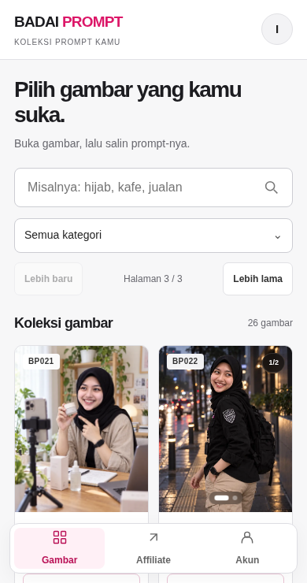
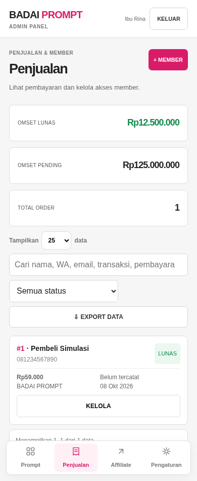

# Audit member area dan admin BADAI PROMPT — 9 Oktober 2026

Perubahan sudah dipublikasikan ke https://badaiprompt.vercel.app/member dan https://badaiprompt.vercel.app/admin. Deployment Vercel `dpl_4NC6dVbpvxnAwectGuU3MTGPot56` berstatus READY. HTML dan CSS/JS live cocok byte demi byte dengan source yang diuji. Source implementasi disimpan di commit `1dfbb037ad8ea4bf46392c6e360154c8d513c334` pada branch `fix/badai-motion`.

Audit final memakai source production `a12d03dc4182811fa683427c09ebbf4cde675017`, bukan checkout lama. Screenshot di bawah diambil dalam pemeriksaan ini, menggunakan akun dan data simulasi serta gambar preview publik. Tidak ada transaksi, akun atau data pelanggan nyata yang dibuat/diubah selama pengujian.

## Alur dan hasil

1. **Login member/admin — baik dalam simulasi.** Sebelumnya layar di belakang formulir masih bisa difokuskan. Sekarang layar belakang inert, Tab dibatasi ke formulir, dan halaman login bisa digulir saat tinggi viewport pendek. Dialog password wajib mengambil prioritas fokus dan tidak bisa ditutup dengan Escape.
2. **Koleksi member — baik dalam simulasi.** Pencarian, kategori, halaman, dan gambar tersimpan tetap bekerja. Menu diberi nama dan penanda halaman aktif untuk pembaca layar; ruang bawah memperhitungkan safe area perangkat.

3. **Detail dan akun — baik dalam simulasi.** Salin prompt, carousel, simpan/hapus favorit, dan dialog akun lulus pemeriksaan. Modal menangani Tab, Escape, pengembalian fokus, serta beberapa dialog yang terbuka bersamaan.
4. **Editor admin — baik dalam simulasi.** Edit judul/kategori/draf, validasi gambar wajib, dan pemeliharaan ID serta file preview lulus pengujian. Kontrol kecil diperbesar di layar sentuh dan input memakai teks 16 px pada layar kecil.
5. **Penjualan — baik dalam simulasi.** Ringkasan omzet sekarang ditata sebagai baris pada ponsel. Nominal Rp12.500.000 dan Rp125.000.000 terlihat utuh; tombol transaksi dan pagination diperbesar.

6. **Pengaturan — baik dalam simulasi.** Tab menyediakan role/aria-selected/aria-controls dan bisa dipindahkan dengan panah kiri/kanan, Home, dan End. Switch dan filter mempunyai nama aksesibel. Secret pembayaran tetap tidak ditampilkan.

## Temuan rute live

`/akses` dan `/akses.html` menghasilkan 404 sebelum perbaikan. Keduanya kini mengarah ke `/member` dengan redirect sementara 307 dan mempertahankan query tautan login. Rute diuji pada server lokal dan domain production.

## Validasi dan batas

- `scripts/verify-workspace-ui.cjs`: member/admin pada 1280, 390, 320 px; pencarian termasuk respons terlambat, salin, carousel, favorit, kategori, pagination, akun, editor/draf, penjualan, pengaturan, penolakan non-admin dan retry gagal muat.
- `scripts/verify-workspace-accessibility.cjs`: 320, 390, 744, 1440 px; nominal besar, navigasi, tab lewat keyboard, prioritas dialog password, dan viewport login pendek.
- Tidak ditemukan galat JavaScript maupun overflow horizontal dalam kasus uji tersebut. Sintaks JavaScript dan git diff check lulus.
- Login, perubahan data akun, dan pembayaran dengan akun asli belum diuji karena sesi pengguna tidak tersedia. Pemeriksaan label dan keyboard ini bukan sertifikasi kepatuhan aksesibilitas penuh; pembaca layar dan perangkat iOS asli belum diuji.

Versi awal yang diperiksa di checkout lama disimpan sebagai draft internal lalu dipulihkan; versi lama itu tidak dipublikasikan.
