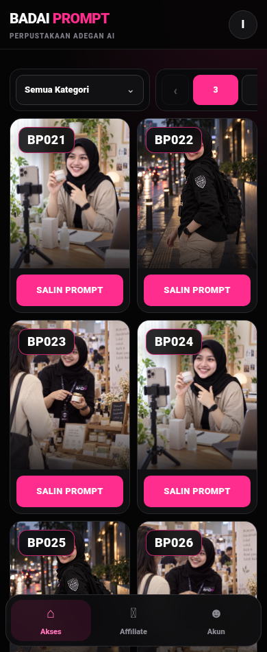
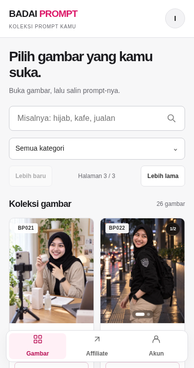
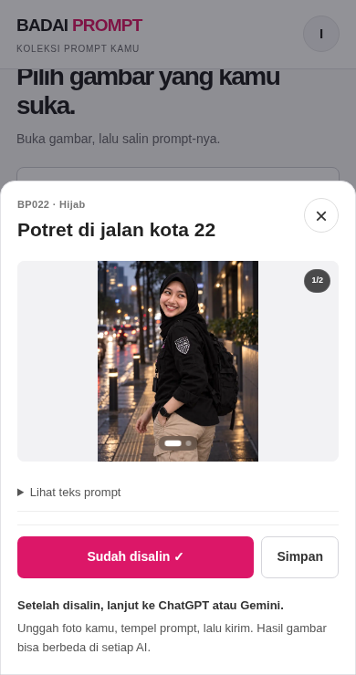
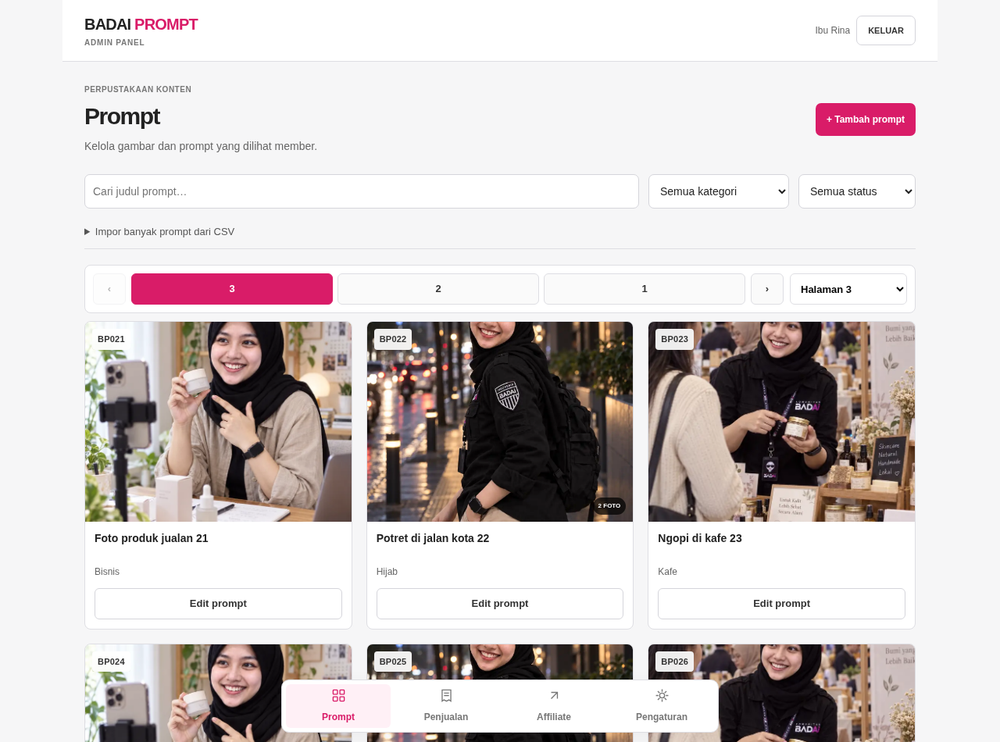
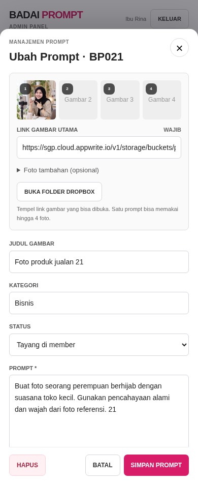
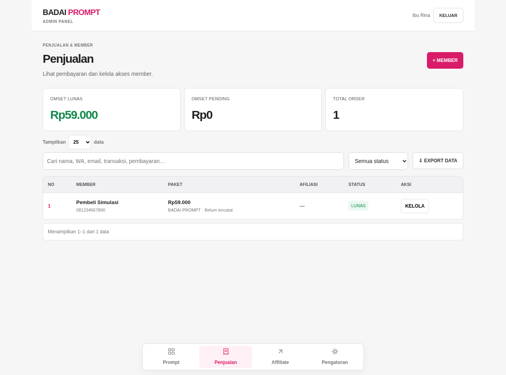
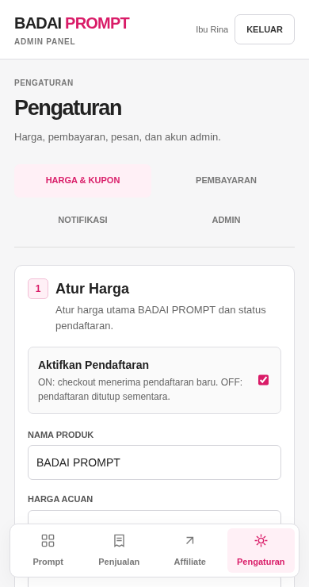

# Member dan admin — perapian 9 Oktober 2026

Tujuan: member langsung memahami pilih gambar → lihat → salin → gunakan di ChatGPT/Gemini. Admin bisa membaca data dan mengelola prompt tanpa teks sangat kecil atau alat impor yang memenuhi halaman utama.

Screenshot dashboard di bawah menggunakan akun dan data simulasi. Foto preview berasal dari aset publik BADAI PROMPT. Login diperiksa dengan SDK Appwrite asli dalam keadaan belum masuk. Pengujian tidak membuat transaksi, akun, atau perubahan data pelanggan sebenarnya.

## Temuan awal

Gambar belum memiliki judul yang terlihat. Pencarian ada dalam kode tetapi tidak tampil. Kategori dan navigasi halaman melebar keluar area layar kecil. Di admin, banyak label berukuran 8–10 px; impor CSV dan gambar besar mengambil sebagian besar ruang layar.

## Alur yang diperiksa

1. **Masuk — baik.** Form member/admin memakai label yang terhubung ke input, ukuran teks terbaca, dan SDK lokal sehingga tidak bergantung pada CDN. Pemeriksaan akun, akses aktif, masa berlaku, dan keanggotaan tim admin tetap digunakan.
2. **Cari dan pilih gambar — baik dalam simulasi.** Ada pencarian, kategori, judul gambar, total hasil, dan dua tombol halaman. Pencarian tidak menutup layar; respons lama tidak menimpa hasil terbaru. Pengguna dapat menemukan gambar tersimpan melalui pilihan kategori. Gagal memuat punya tombol coba lagi.

3. **Buka dan salin — baik dalam simulasi.** Satu aksi utama pada kartu: Lihat & salin. Detail menampilkan gambar, tombol Salin prompt, dan petunjuk penggunaan. Teks prompt bisa dibuka jika perlu. Feedback tampil pada tombol; Simpan adalah aksi sekunder. Dialog mendukung Escape, perpindahan fokus, dan Tab tanpa masuk ke layar di belakang.

4. **Kelola prompt — baik dalam simulasi.** Judul dan kategori tampil pada kartu. Impor CSV serta kolom foto tambahan bisa dibuka saat diperlukan. Editor menyediakan judul, kategori, status tayang/draf, dan teks prompt. Simulasi penyimpanan memeriksa ID, urutan prompt, file preview yang sudah ada, dan payload draf.

5. **Penjualan — baik dalam simulasi.** Angka pendapatan, status pembayaran, pencarian, dan aksi Kelola lebih mudah dibaca. Layar kecil memakai daftar transaksi; desktop memakai tabel.

6. **Pengaturan — baik dalam simulasi.** Harga, pembayaran, notifikasi, dan akun admin tetap terpisah. Empat tab terlihat pada layar kecil. Kolom secret tetap kosong ketika pengaturan dibuka; status penyimpanan ditampilkan terpisah.

## Validasi dan batas

`node scripts/verify-workspace-ui.cjs` memeriksa layar 1280, 390, dan 320 px: navigasi, pencarian, respons pencarian terlambat, clipboard, carousel, favorit, akun, edit prompt, draf, validasi gambar, transaksi, pengaturan pembayaran, dialog, serta penolakan akun non-admin. Dashboard diuji dengan fixture; penyimpanan dan login akun asli belum dilakukan karena sesi pengguna tidak tersedia.

Label, fokus keyboard, dan overflow diperiksa secara programatis. Ini bukan pernyataan kepatuhan aksesibilitas penuh; penggunaan dengan pembaca layar dan pengguna sebenarnya masih perlu diuji.
