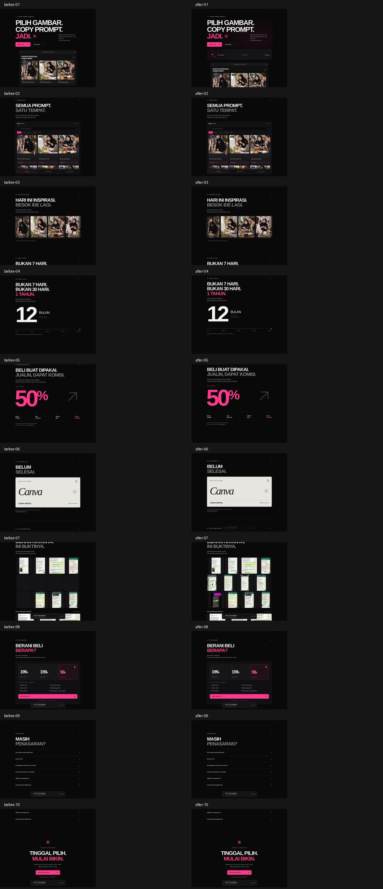

# Audit motion BADAI PROMPT — 8 Oktober 2026

Halaman yang diaudit: https://badaiprompt.vercel.app/. Baseline live dan GitHub cocok dengan commit `003a27f`. Perbaikan runtime: `bbcbabe`. Deployment production `dpl_3XKb3aNb79pjjJyqDzUqy587Y2iM`, status READY.

## Temuan utama

Tidak ditemukan error JavaScript pada halaman live dalam pengujian ini. Semua animasi tidak terbukti rusak: gerakannya terlalu halus/lambat, serta autoplay dapat berhenti karena hover/fokus atau pengaturan reduced motion.

1. **Hero (capture 01):** floating hanya 5px selama 9 detik. Headline kuat dan CTA jelas, tetapi tidak ada motion graphic yang menjelaskan produknya. Ditambahkan orbit garis, spark berputar, aliran cahaya, dan urutan pilih → copy → generate. Floating menjadi 9px/6 detik.
2. **Galeri (capture 03, 07):** durasi 70 detik dan 82–88 detik membuat gerak sulit terlihat. Kecepatan sebelumnya bergantung pada panjang baris. Kini visual bergerak 38px/detik dan testimoni 28px/detik; dua grup identik menjaga loop tersambung.
3. **Testimoni (capture 07):** gambar lazy-load di dalam track transform dapat masuk layar sebelum siap. Beberapa preview kosong terlihat pada capture baseline. Gambar kini dimuat 500px sebelum baris mendekati viewport; autoplay menunggu decode selesai. Kegagalan jaringan eksternal tetap dapat menghasilkan gambar tidak tersedia.
4. **Kontrol viewport:** sebelumnya satu parent wall mengaktifkan seluruh baris. Kini setiap marquee dipantau sendiri dengan intersection threshold 0. Animasi dijeda di luar layar, ketika tab disembunyikan, dan lewat kontrol global.
5. **Sentuhan HP:** CSS hover sebelumnya dapat menahan slider pada perangkat yang mempertahankan hover setelah tap. Hover pause kini hanya untuk mouse; focus pause tetap berlaku untuk keyboard.
6. **Reveal:** konten yang sudah terlihat saat halaman dimuat tidak disembunyikan ulang. Reveal section lain memakai opacity/transform, tanpa blur yang berubah setiap frame.

## Seluruh bagian yang diperiksa

| Capture | Bagian | Kondisi setelah perbaikan |
|---|---|---|
| 01 | Hero | Motion graphic aktif, CTA jelas |
| 02 | Demo Member Area | Alur pilih/buka/copy terlihat; belum pengujian login member |
| 03 | Galeri update | Autoplay berjalan dan loop memakai kecepatan konsisten |
| 04 | Akses satu tahun | Timeline dan penjelasan terbaca |
| 05 | Affiliate | Alur referral terlihat; ketentuan komisi tetap perlu dibaca |
| 06 | Bonus Canva | Kontras visual baik; qualification bonus tetap ditampilkan |
| 07 | Testimoni | Preload baris bergerak diperbaiki; ukuran penuh tersedia lewat lightbox |
| 08 | Harga | Pilihan harga dan CTA tampil; checkout bisa dibuka/ditutup |
| 09 | FAQ | Pertanyaan dan kontrol accordion terlihat |
| 10 | CTA akhir/footer | CTA dan kontrol jeda tersedia |

## Bukti visual

Capture sebelum di kiri, sesudah di kanan, dalam urutan 01–10. Capture sesudah pada contact sheet memakai source perbaikan yang dirender di Chromium; screenshot production hero dan pengujian ulang di domain asli juga dilakukan setelah rilis.

## Validasi dan batasnya

- Chromium desktop 1440px dan HP 390px/320px, kemudian pengujian ulang di domain production dengan simulasi sentuhan HP.
- Hero dan galeri berubah posisi saat autoplay; jeda global, reduced motion, dan checkout buka/tutup lolos.
- Tidak ada overflow horizontal atau pageerror JavaScript pada skenario tersebut.
- Semua 30 gambar original diverifikasi oleh script aset repository.
- Script pembayaran inline identik sebelum/sesudah: SHA-256 `3d6017b17c64084d0919bbaf348b3ffa16cbf8057dd4776941f9db9f49cef394`.
- Tidak membuat pesanan, akun, atau pembayaran nyata. Pemeriksaan log deployment dengan filter error/fatal tidak menemukan catatan pada jendela pemeriksaan; ini bukan jaminan seluruh backend bebas error.
- Animasi baru memakai transform/opacity; bukan video latar atau dependency animasi CDN baru. Server lokal juga diperbaiki untuk mengirim MIME CSS/JavaScript/gambar dengan benar.
- Beberapa label kecil dan teks redup masih berisiko sulit dibaca, terutama di HP. Kontrol reduced motion dan pause dipertahankan. Ini bukan audit WCAG lengkap.
- Belum ada profil frame-time di HP fisik/Safari atau jaringan lambat. Kelancaran pada semua perangkat dan peningkatan konversi belum dibuktikan.

Source runtime berada di branch `fix/badai-motion`. Rilis dilakukan melalui plugin Vercel. Perubahan berikutnya sebaiknya mempertahankan patch ini ketika branch rilis diperbarui.
