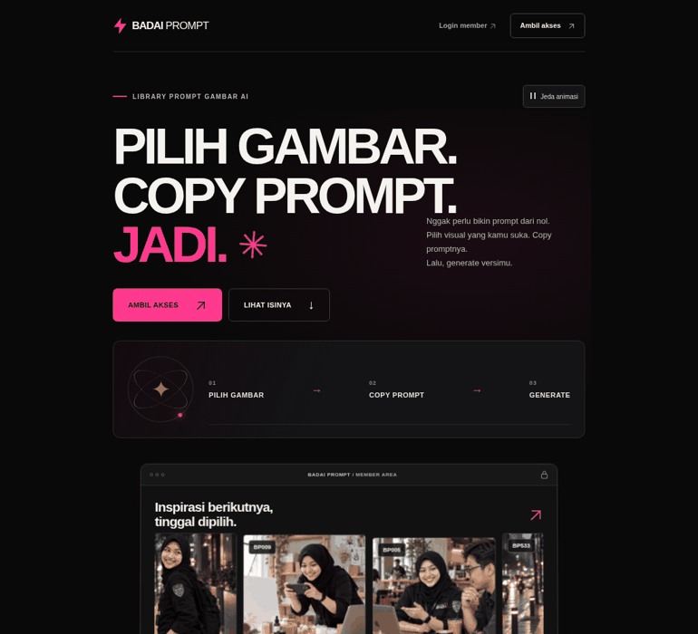
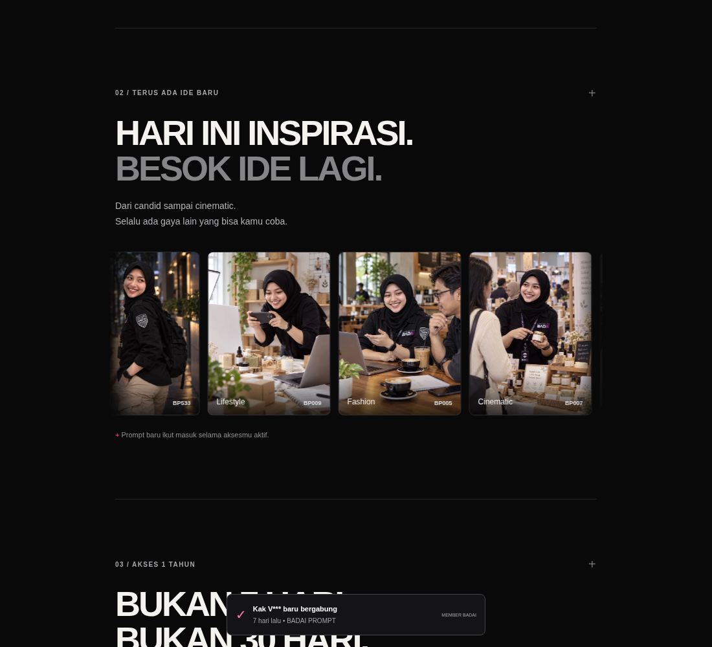
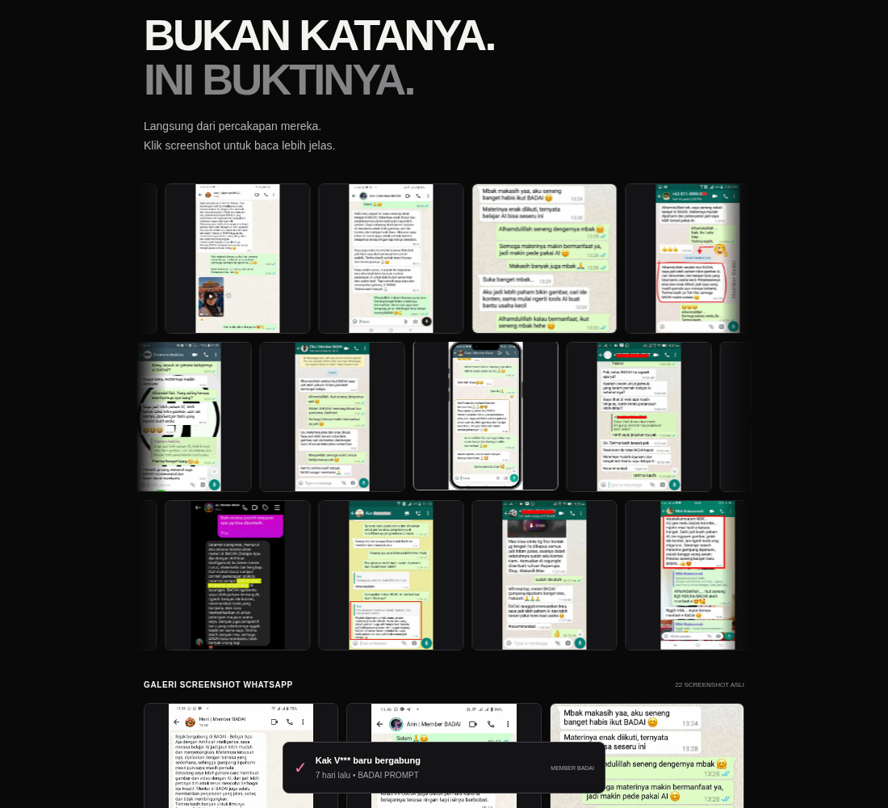

# Audit ulang animasi BADAI PROMPT

Halaman live: https://badaiprompt.vercel.app/?motion=2

Rilis runtime: `67a76e4a98cf4b24e410a7c42543c1bbafd1881a`. Deployment Vercel production `dpl_d5dKJX1zQHdrWMWq9xwT8nfZixT7`, READY.

## Apa yang berhasil direproduksi

Pada pengujian fresh Chrome desktop tanpa reduced motion, versi sebelumnya bergerak. Jadi penyebab persis kondisi statis pada PC pengguna belum dapat dipastikan dari pengujian ini. Namun tiga jalur yang dapat menghentikan motion ditemukan dan diperbaiki:

1. **Script motion gagal:** browser yang hanya menyediakan MediaQueryList API lama memunculkan `reducedMotion.addEventListener is not a function`. Animasi sebelumnya dimulai dalam keadaan paused dan tidak pernah diaktifkan setelah error. API lama kini didukung; CSS juga mulai autoplay tanpa menunggu script atau callback observer.
2. **Reduced motion:** pengaturan perangkat dapat menonaktifkan seluruh animasi, sementara tombol lama tidak menerima perintah untuk mengaktifkannya kembali. Default aksesibilitas tetap dihormati. Tombol baru di hero dan footer dapat mengaktifkan motion secara eksplisit, termasuk pada reduced motion; pilihan disimpan untuk sesi tab.
3. **Autoplay ditahan oleh interaksi/aset:** hover dapat menghentikan slider/demo. Proses decode satu gambar yang tidak selesai menahan seluruh baris. Hover sekarang tidak menghentikan autoplay; loading gambar tidak menjadi syarat jam animasi berjalan. Keyboard focus dan tombol jeda tetap bisa menghentikannya.

Asset CSS/JS memakai versi URL `motion-2` agar browser meminta asset baru. Background tab dan elemen di luar viewport tetap dijeda jika pengamatan viewport tersedia; autoplay mempunyai fallback jika observer tidak tersedia.

## Gerakan yang sekarang terlihat

Strip preview gambar pada hero bergeser secara kontinu, dengan grup duplikat untuk loop. Orbit berputar, spark bergerak dan cahaya mengalir. Preview card juga floating. Galeri update dan tiga baris testimoni mempunyai autoplay sendiri. Demo pilih/buka/copy tidak berhenti hanya karena pointer berada di atasnya; setelah fokus keluar, autoplay dapat dilanjutkan.

## Bukti dari halaman production

Rekaman singkat berikut diambil dari browser yang membuka domain production, tanpa mengganti response dengan source lokal. Ini capture frame nyata, bukan gambar motion yang dibuat secara generatif.

Selama capture, transform strip gambar berubah dari `translateX(-64.8103px)` menjadi `translateX(-269.467px)`. Galeri update dan ketiga baris testimoni juga diuji dengan mengambil transform pada dua waktu berbeda; semuanya berubah.

| Langkah | Surface | Hasil |
|---|---|---|
| 1 | Hero, orbit dan strip gambar | Bergerak pada production; capture frame berubah |
| 2 | Galeri update | Bergerak ketika pointer berada di atas slider |
| 3 | Tiga baris testimoni | Ketiganya berubah posisi dari waktu ke waktu |
| 4 | Kontrol motion dan checkout | Jeda/resume dan opt-in reduced motion lolos; checkout buka/tutup tanpa order |

## Regresi yang diuji

Delapan skenario dijalankan kembali terhadap halaman production:

- Chrome desktop normal.
- Simulasi sentuhan HP lebar 390px dan 320px.
- MediaQueryList dengan API listener lama.
- Reduced motion: default statis, kemudian explicit activation berhasil.
- IntersectionObserver/ResizeObserver tidak tersedia.
- Promise image decode tidak pernah selesai.
- Script `/assets/landing.js` terblokir: animasi CSS masih berjalan.

Pada setiap skenario, orbit, strip gambar hero, dan galeri benar-benar berubah transform. Tidak ada pageerror JavaScript atau overflow horizontal. Pada skenario script aktif, jeda/resume dan checkout buka/tutup juga diuji. Pengujian script terblokir hanya memverifikasi fallback CSS, bukan kontrol interaktif.

Script: `scripts/verify-landing-motion.cjs`. Membutuhkan Node.js, Playwright dan Chromium; default memakai source repository yang dirender pada browser. Jalankan `MOTION_LIVE=1 node scripts/verify-landing-motion.cjs` untuk memeriksa domain live. Network policy environment tetap perlu mengizinkan domain halaman dan aset asli.

Script pembayaran inline tetap identik: SHA-256 `3d6017b17c64084d0919bbaf348b3ffa16cbf8057dd4776941f9db9f49cef394`. Tidak ada pembayaran atau akun baru yang dibuat.

## Batas bukti

Pengujian menunjukkan animasi berjalan pada Chromium dan kondisi simulasi di atas. Ekstensi, pengaturan dan profile Chrome pada PC pengguna tidak tersedia untuk diinspeksi. Ini bukan pengukuran FPS pada semua perangkat atau audit aksesibilitas lengkap. Kontrol reduced motion dan pause dipertahankan untuk pengunjung yang membutuhkan halaman tanpa gerakan.
